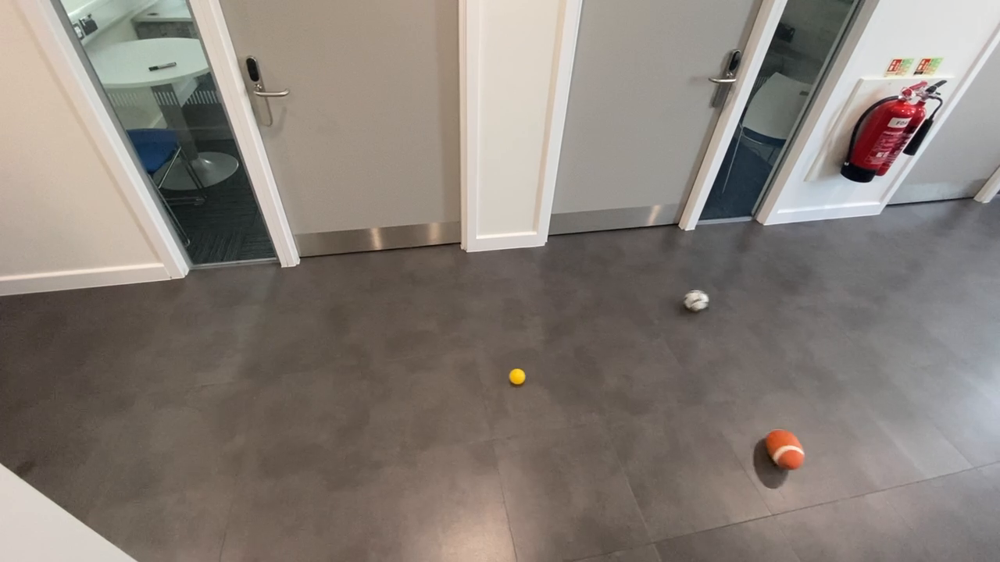
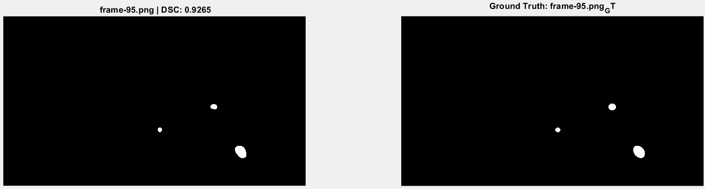
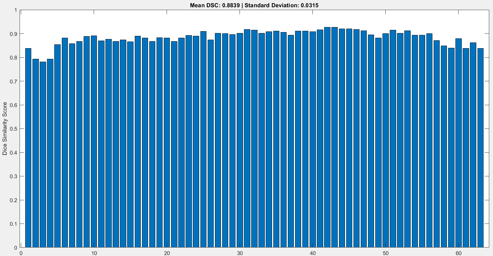

# Image Segmentation Using Classical Methods of Computer Vision
This project proposes a classical computer vision solution for detecting and segmenting colored balls (orange, yellow, white) from indoor RGB images with various lighting conditions. It uses grayscale transformation, Gaussian filtering, adaptive thresholding, HSV color space analysis, and morphological operations. The final segmentation masks achieve a mean Dice Similarity Score (DSC) of **0.8839**.

### 📸 Original Image


### 📸 Segment Image


### 📸 Dice Similarity graph of 64 Image

---

## Dataset Description
- **Total Images**: 126
  - 63 RGB images
  - 63 Ground Truth masks
- **Scene Details**: Balls on gray lobby floors, white walls, doors, glass reflections, varied lighting and shadows.

---

## Methodology

### Step 1: Image Sorting and Pairing
Ensures each RGB image is matched with the correct ground truth (GT) mask.

### Step 2: Grayscale Conversion
Simplifies image, enhances contrast between balls and background.
```matlab
grayImage = rgb2gray(rgbImage);
```

### Step 3: Gaussian Filtering
Removes noise, smooths image.
```matlab
filtered_image = imgaussfilt(grayImage, 1);
```

### Step 4: Adaptive Thresholding
For handling varied lighting/shadow across images.
```matlab
level = adaptthresh(filtered_image, 0.16);
binaryImage = imbinarize(filtered_image, level);
```

### Step 5: Wall Removal (Dynamic Floor Mask)
Removes objects above floor region.
```matlab
floorBoundary = round(height * 0.55 - (0.15 * (1:width) / width * height));
for x = 1:width
    binaryImage(1:floorBoundary(x), x) = 0;
end
```

### Step 6: HSV Color Mask for Orange Ball
HSV mask enables orange ball detection.
```matlab
hsvImage = rgb2hsv(rgbImage);
orangeMask = (hsvImage(:,:,1) >= 0.02 & hsvImage(:,:,1) <= 0.07) & ...
              (hsvImage(:,:,2) >= 0.35 & hsvImage(:,:,2) <= 0.85) & ...
              (hsvImage(:,:,3) >= 0.32 & hsvImage(:,:,3) <= 1.00);
```

### Step 7: Combine Binary + HSV Masks
```matlab
finalSegmentedImage = binaryImage | orangeMask;
```

### Step 8: Morphological Operations
Clean segmentation using:
```matlab
finalSegmentedImage = imclose(finalSegmentedImage, strel('disk', 8));
finalSegmentedImage = imopen(finalSegmentedImage, strel('disk', 8));
```

### Step 9: Dice Similarity Score (DSC) Evaluation
Measures segmentation accuracy against GT mask.
```matlab
intersection = sum(finalSegmentedImage(:) & gtMask(:));
diceScore = (2 * intersection) / (sum(finalSegmentedImage(:)) + sum(gtMask(:)) + 1e-6);
```

---

## Results
- **Mean DSC**: 0.8839
- **Standard Deviation**: 0.0315
- **Best DSC**: 0.9265
- **Worst DSC**: 0.7803

---

## Visualizations
- 5 Best and Worst Segmentations are shown with DSC scores.
- Dice Score Bar Graph plotted.

```matlab
figure;
bar(dscScores);
xlabel('Frame Index');
ylabel('Dice Similarity Score');
title(sprintf('Mean DSC: %.4f | Standard Deviation: %.4f', meanDSC, stdDSC));
ylim([0 1]);
```

---

## Discussion & Conclusion
This classical approach avoids deep learning but achieves high accuracy. Adaptive thresholding handles shadows, HSV handles color, and morphological ops improve boundaries. The pipeline is efficient and interpretable.

---

## MATLAB Notes
- Script processes all images, computes DSCs, and saves segmented results.
- Images are saved as:
```matlab
imwrite(uint8(segmentedImages{i}) * 255, savePath);
```
- Displays segmentation comparisons side-by-side.

---

## References
1. Gonzalez & Woods - Digital Image Processing
2. Sauvola & Pietikäinen - Adaptive Binarization
3. Sural et al. - HSV Color Space Segmentation
4. Criminisi et al. - Single View Metrology
5. Haralick et al. - Mathematical Morphology
6. Pal & Pal - Image Segmentation Review
7. Sezgin & Sankur - Thresholding Survey
8. Dice - Ecologic Association Measure
---

> "This project shows the strength of classical CV methods in constrained environments where DL is not feasible."

